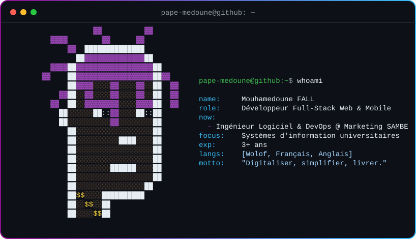

  

  

  

  
  
  
  

 

  

---

## 👨🏾‍💻 À propos

Développeur Full-Stack Web & Mobile, je conçois des applications fiables, performantes et faciles à faire évoluer,
de la base de données jusqu'à l'interface. J'aime les architectures claires, le code lisible et les livraisons régulières,
en méthodologie **Agile / Scrum**.

---

## ✨ Ce que je fais

<table>
  <tr>
    <td width="33%" valign="top">
      <h3 align="center">⚙️ Web & API</h3>
      
Back-ends robustes et API REST bien conçues, avec une attention particulière à la performance et à la sécurité.

    </td>
    <td width="33%" valign="top">
      <h3 align="center">📱 Mobile</h3>
      
Applications mobiles soignées et fluides, pensées pour une expérience utilisateur simple et agréable.

    </td>
    <td width="33%" valign="top">
      <h3 align="center">🚀 DevOps & qualité</h3>
      
Intégration et déploiement continus, conteneurisation, tests et documentation pour des livraisons sereines.

    </td>
  </tr>
</table>

  <em>« Digitaliser, simplifier, livrer : du code propre au service de vrais utilisateurs. »</em>

---

## 🛠️ Stack technique

<table>
  <tr>
    <td align="center" width="150"><b>Backend</b></td>
    <td></td>
  </tr>
  <tr>
    <td align="center"><b>Frontend</b></td>
    <td></td>
  </tr>
  <tr>
    <td align="center"><b>Mobile</b></td>
    <td></td>
  </tr>
  <tr>
    <td align="center"><b>Données</b></td>
    <td></td>
  </tr>
  <tr>
    <td align="center"><b>DevOps & CI/CD</b></td>
    <td>
       
      
      
      
      
    </td>
  </tr>
  <tr>
    <td align="center"><b>Outils & méthodes</b></td>
    <td>
       
      
      
      
      
    </td>
  </tr>
  <tr>
    <td align="center"><b>Sécurité</b></td>
    <td>
      
      
      
      
    </td>
  </tr>
</table>

---

## 📊 Statistiques GitHub

  

  
  

  

  

